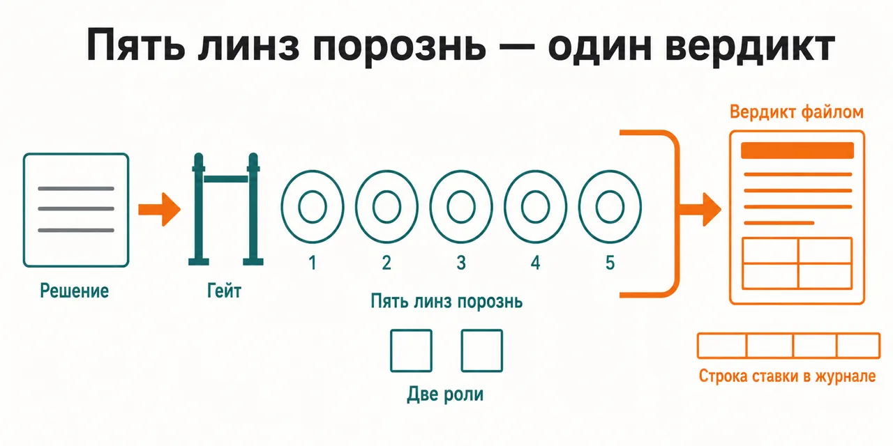
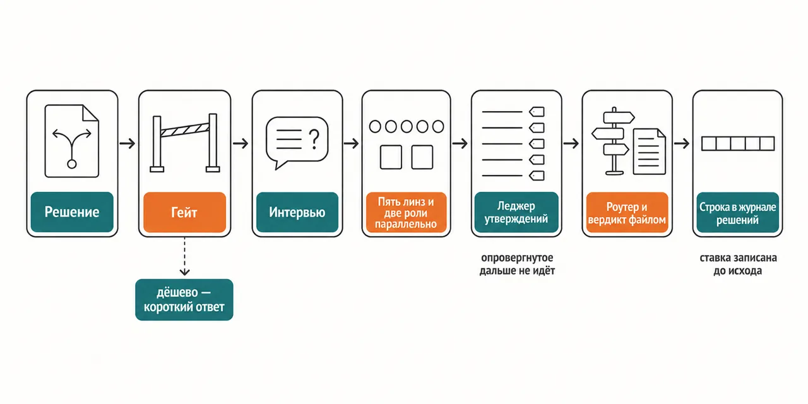

English · [Русский](README.md)

# You make the big call alone — and later you remember neither what you weighed nor what you never saw at all

Five lenses read the decision separately and never see each other's answers, a separate pass marks
the claims one by one before synthesis, and an arbiter first works out whether the environment is predictable
at all — and only then weighs the votes.

```
claude plugin marketplace add https://github.com/beCyborg/jadlis-start.git
claude plugin install advisor-decision@jadlis
```

No keys of any kind: the install asks for one thing only — a folder on your own disk where the
verdict and the decision journal will land; without it the council refuses to write and says so on
the first step.



In words: on the left, the decision in your own words; in the middle, five independent lenses and
two structural roles; on the right, one verdict as a file and a line recording the bet in the
decision journal.

This is my workbench published as it is, not a product: whatever I stopped using, I removed.

## Before → after

| By hand | With an AI chat | With this plugin |
|---|---|---|
| **What the decision is tested against.** One frame — the one currently in your head — and it also decides what counts as important. | It answers in a single voice and adapts to the way the question was phrased. | Five lenses read the decision separately, each from its own digests, and never see each other's answers. |
| **What to do with unanimity.** Everyone agrees, so it must be right; there is nothing to check it against. | Confidence sounds the same where there is a basis and where there is none. | Before synthesis every claim goes through three challenges — evidence, cross-lens conflict, pre-mortem — and gets marked SUPPORTED, CONTESTED, WEAK or REFUTED; whatever is refuted never reaches the "what to do" section. |
| **How far to trust the gut.** Experience counts as an argument the same way in any domain. | A confident tone goes to the parts there is no way to check as well. | The arbiter first classifies the environment after Kahneman and Klein — are there learnable cues and fast feedback — and in an opaque one the intuitive lens loses weight while base rates and formal method gain it. |
| **What analysing a small thing costs.** The heavy procedure goes to whatever question you got round to. | It answers an irreversible call and a trifle at the same length. | A gate at the entrance classifies the decision on three axes — stakes, reversibility, value of more analysis — and on the cheap branch it gives a short answer and never convenes the council. |
| **What is left afterwards.** The choice is made, the reason is gone, and there is nothing to check yourself against. | The chat history keeps no bet and never calls you back to revisit it. | The chosen option, the environment class, the predicted outcomes and the revisit dates are appended to the decision journal before the outcome is known. |

## How it works



Going in — the decision in your own words plus the interview answers: the options including "do
nothing", the real objective, reversibility, the worst case, who carries the loss.
Inside — the gate decides whether to convene the council; five lenses, a devil's advocate and an
outside view answer in parallel and independently; a separate pass marks their claims; the arbiter
weighs the lenses.
Coming out — a verdict as a file in your memory folder and the bet recorded in the decision journal.

In words: decision → gate → interview → five lenses and two roles in parallel → claim ledger →
router and a verdict as a file → a line in the decision journal.

Holding the council together are two roles that are not books. The devil's advocate always runs,
even when every lens agrees: it writes a pre-mortem — the failure examined as if it had already
happened — names the single most likely kill-shot and the linchpin assumptions whose falsity sinks
the decision. The outside view has to name the reference class and the base rate before any story
about why this case is special. Both roles go into the verdict in full.

Weighting is computed by a declared formula — fit to the environment, evidence tier, the result of
the cross-check, relevance — and self-reported confidence is not a factor at all: a confident
heuristic in an opaque environment weighs little, a cautious base rate on home ground weighs a lot.
Two lenses stand partly outside that: the cognitive-biases lens stays on in any environment, and the
convexity lens works lexicographically — a path to unrecoverable loss that it finds overrides both
the router and the vote count. Something counts as consensus only if no fewer than three lenses
converge on it and the ledger has not marked it WEAK or REFUTED. If fewer than four lenses answer
there is no synthesis: you get the verdicts that exist, with a plain note about the short quorum.

The verdict lands as a file in the memory folder: the final decision, why this one and not the
alternatives, what to do, the pre-mortem, a SWOT, a consensus map with a ledger column, each lens's
verdict separately, foreseen versus blind spots, the predicted outcomes and the revisit dates. The
run's working files are deleted once the verdict is written. The decision journal is append-only: at
a revisit the plugin shows you that very bet and asks you to judge the decision apart from the
outcome.

## Installing and the first run

**a) Text to paste to an agent.** Copy the whole thing into a Claude Code chat:

```
You are the installer. Install the plugin advisor-decision from the jadlis marketplace on this Mac.
Then run exactly these commands, verbatim, shortening nothing:
1. claude plugin marketplace add https://github.com/beCyborg/jadlis-start.git
2. claude plugin install advisor-decision@jadlis
3. claude plugin list — show me the line about advisor-decision and its version.
This plugin needs no keys at all and no internet. It asks for one thing — the memory folder
the verdicts and journals are written into: I name that path, you do not invent it.
Before each command show it to me in full and wait for "yes". If I say "no", do not run it,
tell me what you skipped, and move on.
If a command returns an error, stop, show me the output, and do not move to the next one.
```

**b) Commands by hand.**

```
claude plugin marketplace add https://github.com/beCyborg/jadlis-start.git
claude plugin install advisor-decision@jadlis
claude plugin list
```

The first command installs nothing — it adds the marketplace. Only the second one installs, and one
line removes it: `claude plugin uninstall advisor-decision@jadlis --keep-data`.

You can set the memory folder straight in the install — `claude plugin install
advisor-decision@jadlis --config MEMORY_DIR=~/advisors-memory`. The setting is called `MEMORY_DIR`,
its default value is `~/advisors-memory`, and every Jadlis council can share one and the same
folder: the journals and profiles sit in its root, this council's verdicts in the `Решения`
subfolder. Changing the folder later means reinstalling with `--config`: on an already installed
plugin that flag silently changes nothing (checked 2026-09-07). The plugin lays the folder out
itself on the first run and never touches files that are already there.

**c) The short command.** Open Claude Code in the folder you work in and type:

```
/advisor-decision <the decision you are facing>
```

If it is not found, check the name with `claude plugin list`. The council asks questions first — the
base ones about the options, the objective, reversibility and feedback; the rest are collected by the
lenses themselves. The run is visible in `/workflows`.

## Limits, cost, updating

**What it does not do.** It does not decide for you: the verdict is what survived an internal check,
not a confirmed fact about the world, and the consequences stay with you. It does not go online and
does not look at fresh data — the lenses answer from digests inside the plugin, and those age along
with the books. It does not replace a lawyer, an accountant, a financial adviser or a doctor. It
writes nothing outside the memory folder and does not put that folder into git — the decision journal
is private. It does not convene the council for a cheap decision: the gate at the entrance returns a
short answer and says so outright. And it does not produce a full verdict on a short quorum — it
shows what there is, with a note.

**What you need.** No keys at all, no external MCP servers, no third-party CLIs. What you do need is
a folder on disk for the councils' memory and a Claude Code that can run workflows and subagents: the
heavy core runs as the `council-decision-core` workflow, and the roles are played by the
`advisor-decision:advisor-opus` worker subagent pinned to Opus. The book digests inside the plugin
are derivative works with no licence: the boundaries are set out in `NOTICE.md`, and a tag
like `[PREFIX:CODE]` points to a block of a digest inside the plugin, not to a page of a book.

[уточнить] — the repository pins no minimum Claude Code version.

**How tokens get spent.** The light steps are the entrance gate and the interview: they run in your
own session and can close the matter without ever starting the council. A heavy run means dozens of
subagents out of your quota: five lenses, two structural roles and a cross-verification pass, then
the synthesis. A run does not degrade in parts: an exhausted session window brings the whole fan-out
down, so it is better to check what is left of the window before the start than after. Several
councils back to back do not fit into one window.

**Verified where I work:** my Mac, my subscription. Where else this works — [уточнить].

**Terms of use.** There is no license: all rights reserved by the author. You may read it and use it
personally. Commercial use, republishing and bundling it into your own products — by arrangement
with me.

**Updating.** With a third-party marketplace, auto-update is off on your side: until you run the
first command you keep the version you installed. The repository itself is assembled by a generator
from a closed source, so a fix arrives here with the next release rather than as a commit to this
repository.

```
claude plugin marketplace update jadlis
claude plugin update advisor-decision@jadlis
claude plugin list
```

Reinstall, if something ended up crooked:

```
claude plugin uninstall advisor-decision@jadlis --keep-data && claude plugin install advisor-decision@jadlis
```
